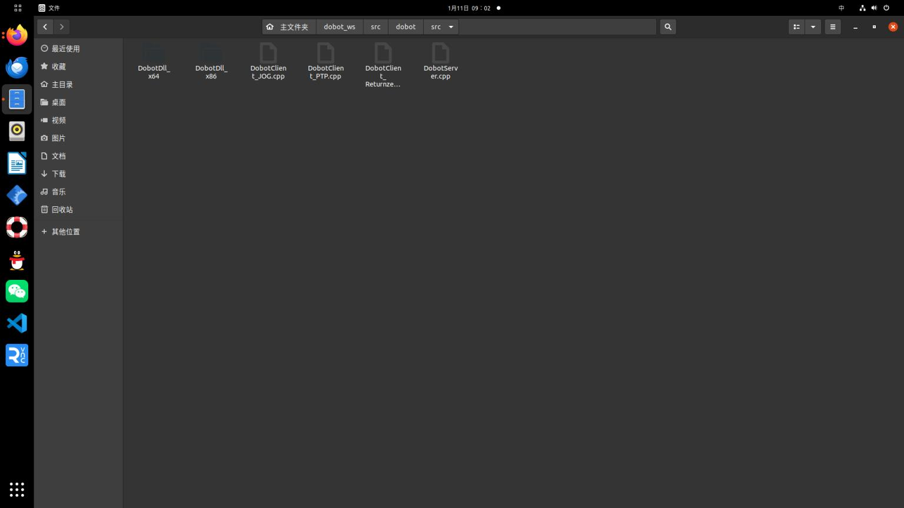

# 如何与dobot真实机械臂联合运动
  这时候就需要修改相应的文件与添加文件

第一步:将官方提供的ros功能包导入自己的工作空间中，官方功能包中包含dobot机械臂启动的服务文件(就是启动机械臂)，还有一些简单控制机械臂的功能(比如回Home位)等，还有将官方提供的srv文件全部拷贝过来


导入之后，需要修改CMakeLists.txt与package.xml文件，此时比较麻烦需要添加很多东西，比如dobot机械臂srv文件等，这时根据官方提供的CMakeLists.txt与package.xml文件复制粘贴。
然后catkin_make编译成功

此时可以尝试一下启动一下dobot机械臂
```bash
roscore
rosrun dobot DobotServer ttyUSB0   开启dobot机械臂服务
rosrun dobot DobotClient_Returnzero  回零操作
```
此时会发现机械臂回零操作功能实现了，说明导入相应包成功了
## 注：有时候启动服务时，会报错，是因为usb端口权限没开

一次性解决其串口权限
```bash
sudo chmod a+rw /dev/ttyUSB0
```

永久性解决其串口权限
    https://blog.csdn.net/c417469898/article/details/117510172
重启电脑才完全生效。。。。。。。。。。。。。。。。。。。。。

第二步：可以查看下面博客，了解下面的修改
https://blog.csdn.net/qq_34935373/article/details/95916111

1:修改dobot_moveit_config/launch包中的文件demo.launch与move_group文件中
```bash
      <arg name="fake_execution_type" default="false"/>
```
然后根据下面图片该注释注释，该添加添加


2: 然后创建 dobot_moveit_controller_manager.launch.xml文件
```xml
<launch>
  <param name="moveit_controller_manager"
         value="moveit_simple_controller_manager/MoveItSimpleControllerManager"/>
  <param name="controller_manager_name" value="/" />
  <param name="use_controller_manager" value="true" />
  <rosparam file="$(find dobot_moveit_config)/config/controllers.yaml"/>
</launch>
```
3.然后在dobot_moveit_config/config中添加controllers.yaml文件
```xml
controller_list:
  - name: arm_controller
    action_ns: follow_joint_trajectory
    type: FollowJointTrajectory
    default: True
    joints:
      - joint_1
      - joint_2
      - joint_5
      - joint_6
```
## 注
这里controllers.yaml文件不需要自己手写，可以直接simple_moveit_controllers.yaml文件里的内容拷贝出来(这是之前在编写controllers.yaml文件时发现与simple_moveit_controllers.yaml文件一致)

那么这里就有另一种方式修改dobot_moveit_controller_manager.launch.xml文件中最后一行
```bash
<rosparam file="$(find dobot_moveit_config)/config4/controllers.yaml"/>
```
对应修改为simple_moveit_controllers.yaml。按照习惯的话。还是采用第一种方式吧

4:添加launch文件方便启动各种文件dobot_moveit_planning_executiuon.launch
```xml
<launch>
  <param name="robot_description" textfile="$(find dobot)/urdf/dobot.urdf" />
  <include file="$(find dobot_moveit_config)/launch/move_group.launch">
    <arg name="publish_monitored_planning_scene" value="true"/>
  </include>
  <!-- The visualization component of MoveIt! -->
  <arg name="use_rviz" default="true" />
  <include file="$(find dobot_moveit_config)/launch/moveit_rviz.launch">
    <arg name="rviz_config" value="$(find dobot_moveit_config)/launch/moveit.rviz"/>
    <arg name="debug" value="false"/>
  </include>
  <include file="$(find dobot)/launch/dobot_gazebo.launch"/>  
</launch>
```
5：会发现这里并没有dobot_gazebo.launch文件，这里添加该dobot文件中添加launch文件

```xml
<launch>
  <!-- Load the CougarBot URDF model into the parameter server -->
  <param name="robot_description" textfile="$(find dobot)/urdf/dobot.urdf" />
 
  <!-- Start Gazebo with an empty world -->
  <include file="$(find gazebo_ros)/launch/empty_world.launch"/>
 
  <!-- Spawn a CougarBot in Gazebo, taking the description from the parameter server -->
  <node name="spawn_urdf" pkg="gazebo_ros" type="spawn_model" args="-param robot_description -urdf -model dobot" />
<rosparam file="$(find dobot)/config/joint_trajectory_controller.yaml" command="load" />
  <!-- Start the controller spawner -->
  <node name="controller_spawner" pkg="controller_manager" type="spawner" respawn="false" output="screen" args="arm_controller joint_state_controller" />

  <!-- Convert joint states to TF transforms for rviz, etc -->
  <node name="robot_state_publisher" pkg="robot_state_publisher" type="robot_state_publisher" respawn="false" output="screen" />
</launch>
```
6. 在 dobot文件夹中 config文件夹添加joint_trajectory_controller.yaml文件，这个文件是创建了一个控制器来控制相关的关节，联合状态发布者joint_state_controller

```xml
arm_controller:
  type: "position_controllers/JointTrajectoryController"
  joints: [joint_1,joint_2,joint_5,joint_6]

joint_state_controller:
  type: "joint_state_controller/JointStateController"
  publish_rate: 50
```
7.先在dobot包里导入JointTrajectory_subscriber.cpp，然后修改cmakelist.txt文件，使其编译成功。
```xml
#include "ros/ros.h"
#include "std_msgs/String.h"
#include "std_msgs/Float32MultiArray.h"
#include "DobotDll.h"

#include <sensor_msgs/JointState.h>
#include <trajectory_msgs/JointTrajectory.h>
#include <control_msgs/FollowJointTrajectoryActionGoal.h>
#include <math.h>

#include "dobot/SetCmdTimeout.h"
#include "dobot/SetQueuedCmdClear.h"
#include "dobot/SetQueuedCmdStartExec.h"
#include "dobot/SetQueuedCmdForceStopExec.h"
#include "dobot/GetDeviceVersion.h"

#include "dobot/SetEndEffectorParams.h"
#include "dobot/SetPTPJointParams.h"
#include "dobot/SetPTPCoordinateParams.h"
#include "dobot/SetPTPJumpParams.h"
#include "dobot/SetPTPCommonParams.h"
#include "dobot/SetPTPCmd.h"
void callback(const control_msgs::FollowJointTrajectoryActionGoal::ConstPtr &msg);
ros::ServiceClient client_1;
ros::ServiceClient client_2;
ros::ServiceClient client_3;
ros::ServiceClient client_4;
ros::ServiceClient client_5;
ros::ServiceClient client_6;
ros::ServiceClient client_7;
ros::ServiceClient client_8;
ros::ServiceClient client_9;
ros::ServiceClient client_10;
int main(int argc, char **argv)
{

ros::init(argc, argv, "JointTrajectory_subscriber");
ros::NodeHandle n;
ros::ServiceClient client;

client_1 = n.serviceClient<dobot::SetCmdTimeout>("/DobotServer/SetCmdTimeout");

client_2 = n.serviceClient<dobot::SetQueuedCmdClear>("/DobotServer/SetQueuedCmdClear");

client_3 = n.serviceClient<dobot::SetQueuedCmdStartExec>("/DobotServer/SetQueuedCmdStartExec");

client_4 = n.serviceClient<dobot::GetDeviceVersion>("/DobotServer/GetDeviceVersion");

client_5 = n.serviceClient<dobot::SetEndEffectorParams>("/DobotServer/SetEndEffectorParams");

client_6 = n.serviceClient<dobot::SetPTPJointParams>("/DobotServer/SetPTPJointParams");


client_7 = n.serviceClient<dobot::SetPTPCoordinateParams>("/DobotServer/SetPTPCoordinateParams");


client_8 = n.serviceClient<dobot::SetPTPJumpParams>("/DobotServer/SetPTPJumpParams");


client_9 = n.serviceClient<dobot::SetPTPCommonParams>("/DobotServer/SetPTPCommonParams");

client_10 = n.serviceClient<dobot::SetPTPCmd>("/DobotServer/SetPTPCmd");


ROS_INFO("JointTrajectory_subscriber running.../n");

ros::Rate loop_rate(30);
ros::Subscriber trajectory_sub = n.subscribe("/arm_controller/follow_joint_trajectory/goal", 10, callback);

ros::spin();


return 0;
}

void callback(const control_msgs::FollowJointTrajectoryActionGoal::ConstPtr &msg)
{

int trajectory_length = msg->goal.trajectory.points.size();
std::cout << "/n/nlength of trajectory points is:" << trajectory_length << std::endl << std::endl;


// SetCmdTimeout
dobot::SetCmdTimeout srv1;
srv1.request.timeout = 3000;
if (client_1.call(srv1) == false) {
ROS_ERROR("Failed to call SetCmdTimeout. Maybe DobotServer isn't started yet!");
return ;
}

// Clear the command queue
dobot::SetQueuedCmdClear srv2;
client_2.call(srv2);


// Start running the command queue
dobot::SetQueuedCmdStartExec srv3;
client_3.call(srv3);

// Get device version information
dobot::GetDeviceVersion srv4;
client_4.call(srv4);
if (srv4.response.result == 0) {
ROS_INFO("Device version:%d.%d.%d", srv4.response.majorVersion, srv4.response.minorVersion, srv4.response.revision);
} else {
ROS_ERROR("Failed to get device version information!");
}

// Set end effector parameters
dobot::SetEndEffectorParams srv5;
srv5.request.xBias = 0;
srv5.request.yBias = 0;
srv5.request.zBias = 0;
client_5.call(srv5);


// Set PTP joint parameters
do {
dobot::SetPTPJointParams srv;

for (int i = 0; i < 4; i++) {
srv.request.velocity.push_back(100);
}
for (int i = 0; i < 4; i++) {
srv.request.acceleration.push_back(100);
}
client_6.call(srv);
} while (0);

// Set PTP coordinate parameters
do {
dobot::SetPTPCoordinateParams srv;

srv.request.xyzVelocity = 100;
srv.request.xyzAcceleration = 100;
srv.request.rVelocity = 100;
srv.request.rAcceleration = 100;
client_7.call(srv);
} while (0);

// Set PTP jump parameters
do {
dobot::SetPTPJumpParams srv;

srv.request.jumpHeight = 20;
srv.request.zLimit = 200;
client_8.call(srv);
} while (0);

// Set PTP common parameters
do {
dobot::SetPTPCommonParams srv;

srv.request.velocityRatio = 50;

srv.request.accelerationRatio = 50;
client_9.call(srv);
} while (0);

dobot::SetPTPCmd srv;
/* for (int i = 0; i < trajectory_length - 1; i++)
{
srv.request.ptpMode = 4;
srv.request.x = (float)msg->goal.trajectory.points[i].positions[0] / (float)M_PI * 180;
srv.request.y = (float)msg->goal.trajectory.points[i].positions[1] / (float)M_PI * 180;;
srv.request.z = (float)msg->goal.trajectory.points[i].positions[2] / (float)M_PI * 180;;
srv.request.r = 0;
client_10.call(srv);
}
*/
/*srv.request.ptpMode = 4;
srv.request.x = (float)msg->goal.trajectory.points[0].positions[0] / (float)M_PI * 180;
srv.request.y = (float)msg->goal.trajectory.points[0].positions[1] / (float)M_PI * 180;;
srv.request.z = (float)msg->goal.trajectory.points[0].positions[2] / (float)M_PI * 180;;
srv.request.r = 0;
client_10.call(srv);
*/
srv.request.ptpMode = 4;
srv.request.x = (double)msg->goal.trajectory.points[trajectory_length-1].positions[0] / (double)M_PI * 180;
srv.request.y = (double)msg->goal.trajectory.points[trajectory_length-1].positions[1] / (double)M_PI * 180;;
srv.request.z = (double)msg->goal.trajectory.points[trajectory_length-1].positions[2] / (double)M_PI * 180;;
srv.request.r = 0;
client_10.call(srv);

}
```

最后，可以测试一下是否成功。
```bash
1:roscore
2:rosrun dobot DobotServer ttyUSB0
3:roslaunch dobot_moveit_config dobot_moveit_planning_executiuon.launch
4启动JointTrajectory_subscriber.cpp
rosrun dobot JointTrajectory_subscriber
```
此时可以点击rviz中预设的位置，发现真实机械臂与rviz，gazebo中模型同时运动。

## 补充
effort transmission 力/扭矩传动:该传动类型假定机械臂的控制输入是力/扭矩，用于控制关节的扭矩或力。适用于需要对关节施加特定力或扭矩来实现和力感知的应用
Velocity(速度) 适用于控制执行器以特定的速度运行。它可用于需要执行平滑，连续运动的任务
Position位置  适用于控制执行器移动到特定位置或关节角度。它可用于需要执行准确位置控制的任务。

https://blog.csdn.net/m0_56661101/article/details/131415296