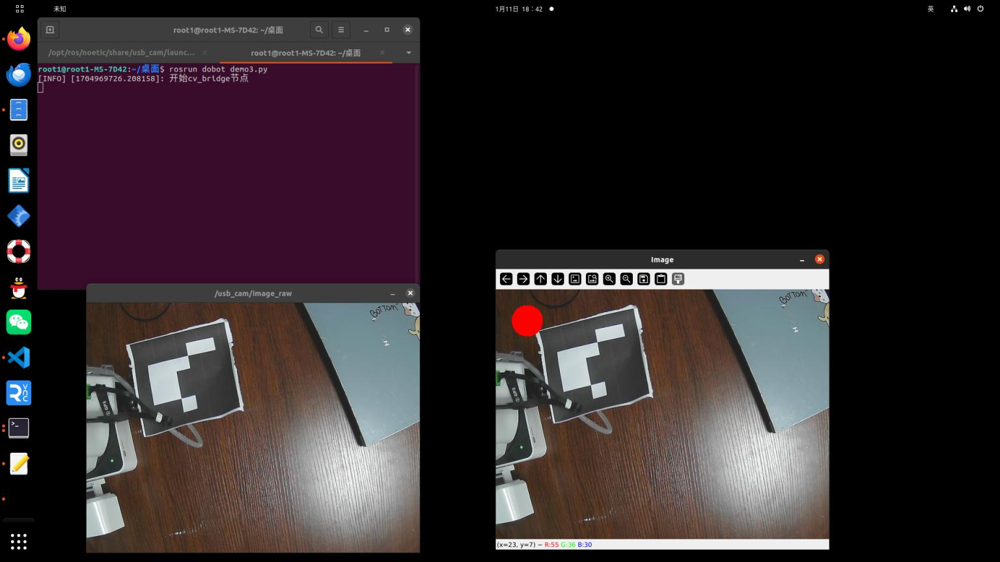

# 摄像头usb 使用cv_bridge 简单的显示一个红色的圆
```xml

#!/usr/bin/env python3
# -*- coding:utf-8 -*-
import rospy
from cv_bridge import CvBridge, CvBridgeError
from sensor_msgs.msg import Image
import cv2

class Demo3:
    def __init__(self):
        # 创建cv_bridge, 声明图像的发布者和订阅者
        self.image_pub = rospy.Publisher("cv_image", Image, queue_size=1)
        self.bridge = CvBridge()
        self.image_sub = rospy.Subscriber("/usb_cam/image_raw", Image, self.callback)

    def callback(self, data):
        # 使用cv_bridge将ROS的图像数据转换为Opencv的图像格式
        try:
            cv_image = self.bridge.imgmsg_to_cv2(data, 'bgr8')
        except CvBridgeError as e:
            print(e)

        # 在opencv的显示窗口中绘制一个圆，作为标记
        (rows, cols, channels) = cv_image.shape
        if cols > 60 and rows > 60:
            cv2.circle(cv_image, (60, 60), 30, (0, 0, 255), -1)

        # 显示Opencv格式的图像
        cv2.imshow("Image", cv_image)
        cv2.waitKey(3)

        # 再将opencv格式数据转换成ros image格式的数据发布
        try:
            self.image_pub.publish(self.bridge.cv2_to_imgmsg(cv_image, 'bgr8'))
        except CvBridgeError as e:
            print(e)

if __name__ == '__main__':
    try:
        # 初始化ros节点
        rospy.init_node("cv_bridge_test")
        rospy.loginfo("开始cv_bridge节点")
        Demo3()
        rospy.spin()
    except KeyboardInterrupt:
        print("关闭节点")
```
