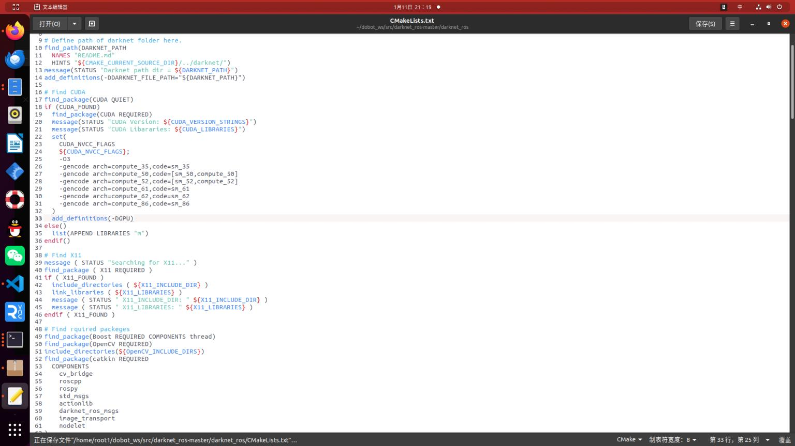
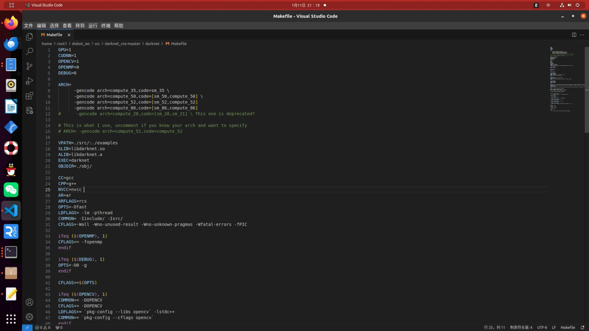
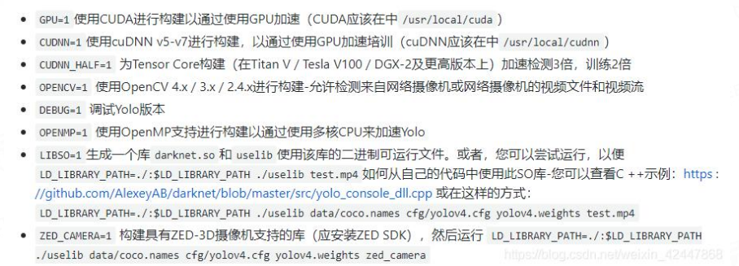
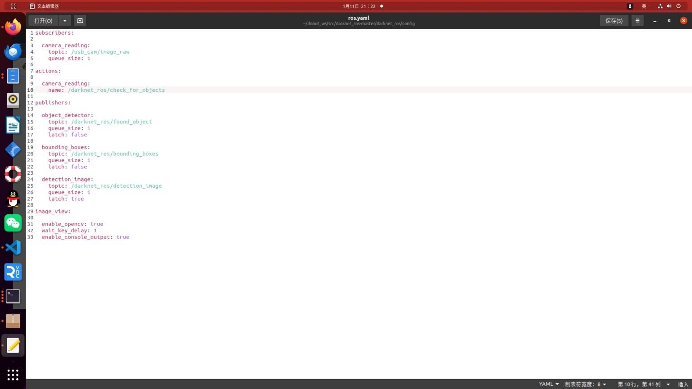
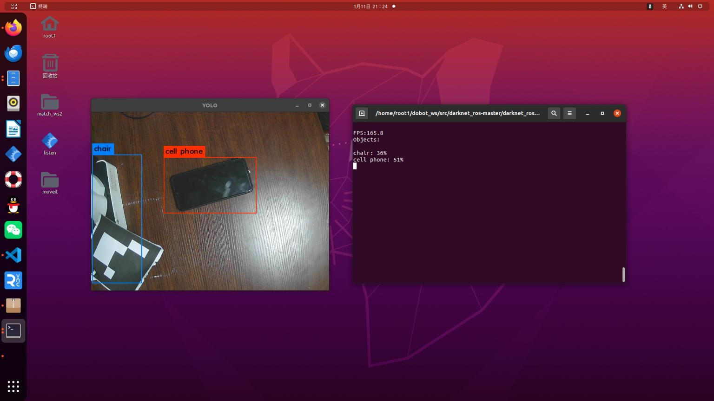

# 使用darknrt_ros包简单检测目标

1. 为了避免catkin_make太慢，这里直接将模型文件先下载好
/home/root1/dobot_ws/src/darknet_ros-master/darknet_ros/yolo_network_config/weights文件下,打开文件直接复制粘贴在终端下载即可
2. 进到darknet目录下进行make
此时仍然编译不成功，接下来需要修改文件 (因为自己电脑的GPU与算力太高)


相关参数说明：

修改之后，编译成功，此时还不能运行，因为与自己摄像头的话题不一致，需要修改文件


之后启动
```bash
roslaunch usb_cam usb_cam-test.launch
roslaunch darknet_ros darknet_ros.launch
```
此时发现帧率非常高，这是因为在上面配置中使用了GPU，与CUDNN加速

