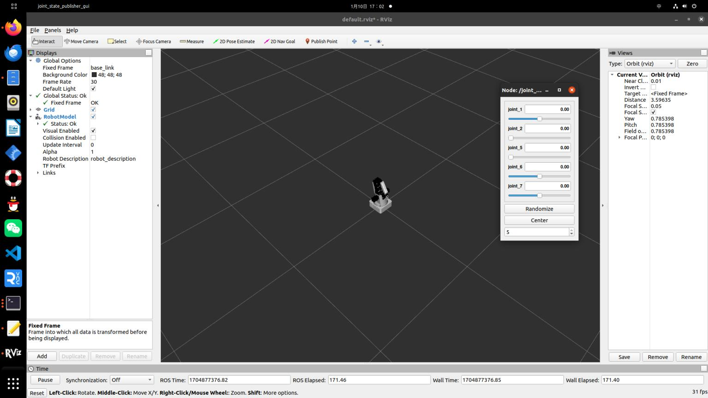

# Dobot在Rviz中显示

为了在Rviz中展示Dobot机械臂，我们需要按照以下步骤操作：

1. 首先，您需要创建一个新的ROS工作空间，命名为`dobot_ws`，随后在这个工作空间中创建一个名为`dobot`的功能包。

2. 然后，创建必要的文件夹，包括`launch`、`urdf`、`meshes`等。这里直接导入官方提供的功能包即可。

3. 最后，在`launch`文件夹中创建一个名为`dobot.launch`的launch文件，内容如下：

```xml
   <launch>
       <param name="robot_description" textfile="$(find dobot)/urdf/dobot.urdf" />
       <node pkg="rviz" type="rviz" name="rviz" />
       <node pkg="robot_state_publisher" type="robot_state_publisher" name="robot_state_publisher" />
       <node pkg="joint_state_publisher" type="joint_state_publisher" name="joint_state_publisher" />
       <node pkg="joint_state_publisher_gui" type="joint_state_publisher_gui" name="joint_state_publisher_gui" />
   </launch>
```

## 启动命令

        roslaunch dobot dobot.launch

此时你可以在Rviz中看到Dobot机械臂的模型了,并可以通过插件控制各关节移动

