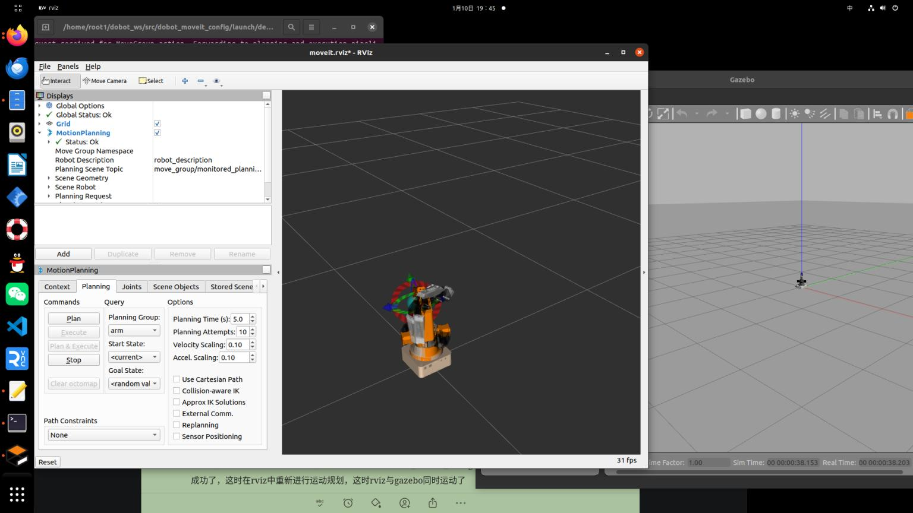

# Gazebo 与 RViz 联合仿真

在未配置前，启动以下命令会报错:

```bash
roslaunch dobot_moveit_config demo_gazebo.launch
```
错误提示： 这是因为官方提供的urdf少了gazebo少了一些配置，接下来就是为urdf加上相应的配置动态链.so文件。

## URDF Gazebo 配置   在URDF文件末端添加配置

```xml
    <transmission name="tran1">
        <type>transmission_interface/SimpleTransmission</type>
        <joint name="joint_1">
             <hardwareInterface>hardware_interface/PositionJointInterface</hardwareInterface>
        </joint>
        <actuator name="motor1">
             <hardwareInterface>hardware_interface/PositionJointInterface</hardwareInterface>
            <mechanicalReduction>1</mechanicalReduction>
        </actuator>
    </transmission>
    <transmission name="tran2">
        <type>transmission_interface/SimpleTransmission</type>
        <joint name="joint_2">
           <hardwareInterface>hardware_interface/PositionJointInterface</hardwareInterface>
        </joint>
        <actuator name="motor2">
            <hardwareInterface>hardware_interface/PositionJointInterface</hardwareInterface>
            <mechanicalReduction>1</mechanicalReduction>
        </actuator>
    </transmission>
    <transmission name="tran5">
        <type>transmission_interface/SimpleTransmission</type>
        <joint name="joint_5">
            <hardwareInterface>hardware_interface/PositionJointInterface</hardwareInterface>
        </joint>
        <actuator name="motor5">
        <hardwareInterface>hardware_interface/PositionJointInterface</hardwareInterface>
            <mechanicalReduction>1</mechanicalReduction>
        </actuator>
    </transmission>
    <transmission name="tran6">
        <type>transmission_interface/SimpleTransmission</type>
        <joint name="joint_6">
             <hardwareInterface>hardware_interface/PositionJointInterface</hardwareInterface>
        </joint>
        <actuator name="motor6">
             <hardwareInterface>hardware_interface/PositionJointInterface</hardwareInterface>
            <mechanicalReduction>1</mechanicalReduction>
        </actuator>
    </transmission>
   
    <gazebo>
        <plugin name="gazebo_ros_control" filename="libgazebo_ros_control.so" />
        <robotNamespace>/</robotNamespace>
    </gazebo>
    <gazebo>
        <plugin name="joint_state_publisher" filename="libgazebo_ros_joint_state_publisher.so">
            <jointName>joint_1, joint_2, joint_5,joint_6</jointName>
        </plugin>
    </gazebo>
```

解析：这是为关节添加传动机制，硬件接口和执行器，这样它们就可以被控制
而gazebo标签是为urdf添加的gazebo控制器(插件)

gazebo_ros_control自身是去参数的，因此会发现启动时会发现获取不了pid参数，其实也可以忽略该错误，也能执行
如果想要pid参数，可以通过ros的ros_control框架和相关的控制器管理器以及机器人模型中的关节控制器来设定pid增益。（也可以直接通过参数服务器来设置增益），并未尝试。。。。

再次启动
```bash
roslaunch dobot_moveit_config demo gazebo.launch
```
会发现成功了，这时在rviz中重新进行运动规划，这时rviz与gazebo同时运动了
