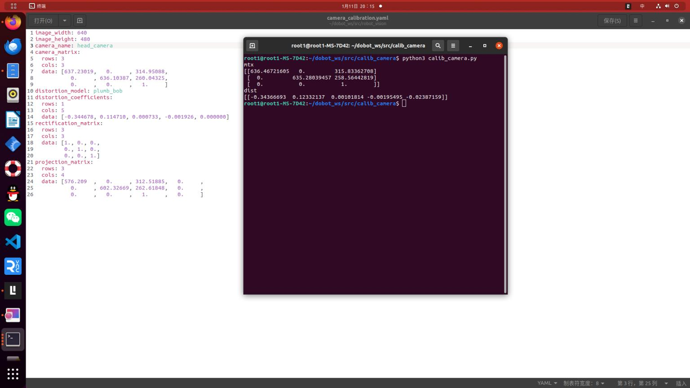

# 对摄像头进行内参标定
1.安装robot_vision包
```bash
git clone https://mirror.ghproxy.com/https://github.com/1417265678/robot_vision
catkin_make
```
2 安装camera_calibration包
```bash
    sudo apt-get install ros-noetic-camera-calibration
```
3 启动标定程序
```bash
    roslaunch robot_vision usb_cam.launch
    rosrun camera_calibration cameracalibrator.py --size 8x5 --square 0.027 image:=/usb_cam/image_raw camera:=/usb_cam
```


这里使用的是内角点为8x5，方块边长为0.027m，标定图像为usb_cam/image_raw，标定相机为usb_cam。

4：标定摄像头
      - **把标定板放置在摄像头视野范围内**
      - **X：标定板在摄像头视野中的左右移动**
      - **Y：标定板在摄像头视野的上下移动**
      - **Size：标定板在摄像头视野中的前后移动**
      - **Skew：标定板在摄像头视野中的倾斜转动**
不断移动标定板，直到CALIBRATE按钮变色，点击开始自动计算摄像头的标定参数，点击save按钮，标定参数将被保存到默认的文件夹下

点击COMMIT按钮，提交数据并退出程序，打开/tmp文件，就可以看到标定结果的压缩文件


解压该文件，找到ost.yaml命名的标定结果文件，将该文件复制出来，重新命名就可以使用了。

内参：需要标定的相机的参数，它决定了物体的实际位置在成像平面上的投影位置

为了检验camera_calibration包获取内参的准确程度，这里导入了另一个包calib_camera包，而获取内参的图片仍然是camera_calibration包获取的图片,发现结果相差不大。

白色图是camera_calibration包获取的，终端是程序获取的。