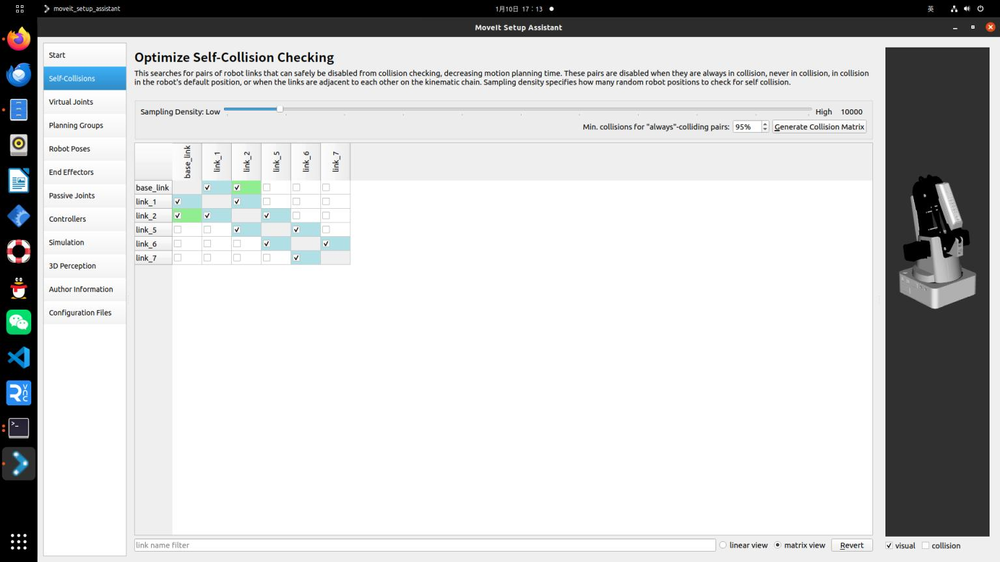

## Moveit!生成相应配置文件
启动命令
```bash
rosrun moveit_setup_assistant moveit_setup_assistant.py
```
1.1 创建新的Moveit!配置文件,并加载URDF文件，点击load files

1.2 自碰撞检测设置，按照默认值就ok。
什么是自碰撞检测配置? 机器人在规划运动轨迹的时候可能会出现自身结构相互碰撞的情况，所以需要设置自碰撞检测。

1.3 设置虚拟关节
什么是虚拟关节? 虚拟关节就是定义一个关节将机器人与世界链接起来，这里并没有进行设置
1.4  **创建planning group**: 这是使用Moveit!的一个核心步骤，需要设置机器人的各个部分的名称及其父级名称。
  - **规划组名称**: `arm`
  - **运动学逆解工具**:
    - 初始选择: `KDL`
    - 后改为: `IKFAST`
  - **运动规划参数**:
    - 可以按照默认值
  - **Kin. Search Resolution**:
    - 关节空间的采样密度
  - **Kin. Search Timeout**:
    - 求解时间
  - **Kin. Solver Attempts**:
    - 求解失败尝试次数

OMPL算法选择RRTConnect 算法，在论文中比较了三种算法，为RRT,RRT*,RRTConnect，可以自己查询资料了解三种算法的区别。


1.5 设置robot poses
这一步可以预先设置好一些机器人姿态，就像宏定义一样，方便后面调用。可以手动调节也可以输入数值来调节，调节的单位为弧度


- **1.6 配置末端执行器**:
  - 这里并没有进行设置。

- **1.7 设置被动关节**:
  - 这里也没有进行设置。
  - **被动关节定义**: 被动关节是无法主动运动的关节，也就是说，它依赖于其他部件的运动。设置为被动关节后，该关节不会参与运动规划。

- **1.8 设置作者等信息**:
  - 填写相关的作者、机构、联系方式等信息。

- **1.9 保存配置文件**:
  - 文件名设为 `dobot_moveit_config`。
    
