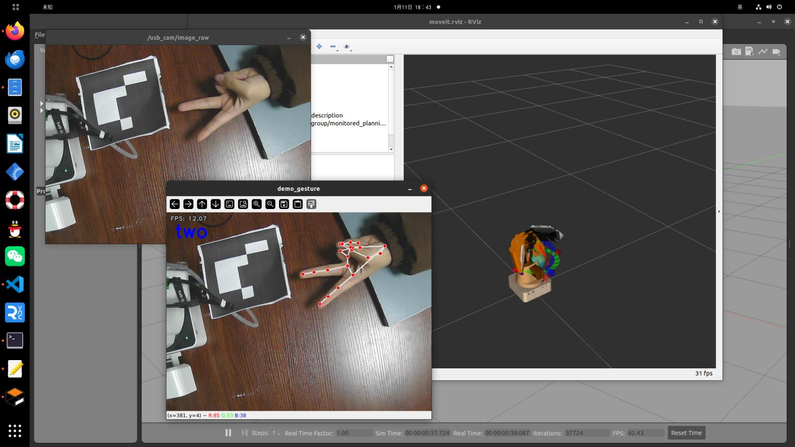

# 使用手势简单的控制机械臂
```xml
#!/usr/bin/env python3
#coding=utf-8

import os
import sys
import time
import mediapipe as mp
import numpy as np
import threading
import rospy
import cv2
import moveit_commander
from geometry_msgs.msg import PoseStamped
from sensor_msgs.msg import Image
from cv_bridge import CvBridge

# Global variables
img_path = '/home/root1/dobot_ws/src/dobot/images'
img_num = 1
cv_image = np.zeros((480, 640, 3), np.uint8)
mp_drawing = mp.solutions.drawing_utils
mp_hands = mp.solutions.hands
gesture = "none"
gesture_lock = threading.Lock()
bridge = CvBridge()

# Initialize MoveIt
def MoveitJointpose():
    moveit_commander.roscpp_initialize(sys.argv)
    arm = moveit_commander.MoveGroupCommander('arm')
    arm.set_goal_joint_tolerance(0.01)
    arm.set_max_velocity_scaling_factor(0.8)
    return arm

# Display FPS on the image
def show_fps(img):
    global fps
    fps_text = 'FPS: {:.2f}'.format(fps)
    cv2.putText(img, fps_text, (10, 20), cv2.FONT_HERSHEY_PLAIN, 1.0, (240, 240, 240), 1, cv2.LINE_AA)
    return img

# Calculate distance between two points
def distance(point_1, point_2):
    return np.sqrt((point_1[0] - point_2[0]) ** 2 + (point_1[1] - point_2[1]) ** 2)

# Calculate angle between two vectors
def vector_2d_angle(v1, v2):
    norm_v1_v2 = np.linalg.norm(v1) * np.linalg.norm(v2)
    cos = v1.dot(v2) / (norm_v1_v2)
    sin = np.cross(v1, v2) / (norm_v1_v2)
    angle = np.degrees(np.arctan2(sin, cos))
    return angle

# Convert hand landmarks to image coordinates
def get_hand_landmarks(img_size, landmarks):
    w, h = img_size
    landmarks = [(lm.x * w, lm.y * h) for lm in landmarks]
    return np.array(landmarks)

# Calculate angles of each finger
def hand_angle(landmarks):
    angle_list = []
    angle_ = vector_2d_angle(landmarks[3] - landmarks[4], landmarks[0] - landmarks[2])
    angle_list.append(angle_)
    angle_ = vector_2d_angle(landmarks[0] - landmarks[6], landmarks[7] - landmarks[8])
    angle_list.append(angle_)
    angle_ = vector_2d_angle(landmarks[0] - landmarks[10], landmarks[11] - landmarks[12])
    angle_list.append(angle_)
    angle_ = vector_2d_angle(landmarks[0] - landmarks[14], landmarks[15] - landmarks[16])
    angle_list.append(angle_)
    angle_ = vector_2d_angle(landmarks[0] - landmarks[18], landmarks[19] - landmarks[20])
    angle_list.append(angle_)
    angle_list = [abs(a) for a in angle_list]
    return angle_list

# Determine gesture based on finger angles
def h_gesture(angle_list):
    # Thresholds for angles
    thr_angle = 65.
    thr_angle_thumb = 53.
    thr_angle_s = 49.
    
    gesture_str = "none"
    if (angle_list[0] > thr_angle_thumb) and (angle_list[1] > thr_angle) and (angle_list[2] > thr_angle) and (angle_list[3] > thr_angle) and (angle_list[4] > thr_angle):
        gesture_str = "fist"
    # Add other gesture conditions here
    return gesture_str

# Image callback function
def callback(data):
    global cv_image
    try:
        cv_image = bridge.imgmsg_to_cv2(data, "bgr8")
    except CvBridgeError as e:
        print(e)

# Main function for gesture inference
def infer():
    global img_num, cv_image, gesture
    with mp_hands.Hands(min_detection_confidence=0.5, min_tracking_confidence=0.5) as hands:
        while not rospy.is_shutdown():
            image = cv_image.copy()
            results = hands.process(cv2.cvtColor(image, cv2.COLOR_BGR2RGB))
            gesture_str = "none"

            if results.multi_hand_landmarks:
                for hand_landmarks in results.multi_hand_landmarks:
                    mp_drawing.draw_landmarks(image, hand_landmarks, mp_hands.HAND_CONNECTIONS)
                    landmarks = get_hand_landmarks((image.shape[1], image.shape[0]), hand_landmarks.landmark)
                    angle_list = hand_angle(landmarks)
                    gesture_str = h_gesture(angle_list)
                    if gesture_str != "none":
                        break
            
            with gesture_lock:
                gesture = gesture_str

            image = show_fps(image)
            cv2.putText(image, gesture_str, (20, 60), cv2.FONT_HERSHEY_SIMPLEX, 1.5, (255, 0, 0), 4)
            cv2.imshow('demo_gesture', image)
            key_val = cv2.waitKey(33)
            if key_val == ord('c'):
                cv2.imwrite(os.path.join(img_path, f'{img_num}.jpg'), image)
                img_num += 1

# Thread for acting based on detected gesture
def infer_act():
    global gesture, arm
    while not rospy.is_shutdown():
        with gesture_lock:
            current_gesture = gesture
        if current_gesture == "one":
            arm.set_named_target('Home')
            arm.go()
            rospy.sleep(1)
        elif current_gesture == "two":
            arm.set_named_target('eye_hand')
            arm.go()
            rospy.sleep(1)
        time.sleep(0.1)

if __name__ == '__main__':
    rospy.init_node("demo_gesture")
    arm = MoveitJointpose()
    rospy.loginfo("Starting gesture recognition")

    image_sub = rospy.Subscriber("/usb_cam/image_raw", Image, callback)
    
    try:
        thread = threading.Thread(target=infer)
        thread_act = threading.Thread(target=infer_act)
        thread.start()
        thread_act.start()
        thread.join()
        thread_act.join()
        rospy.spin()
    except KeyboardInterrupt:
        print("Gesture recognition closed")
        cv2.destroyAllWindows()

```
