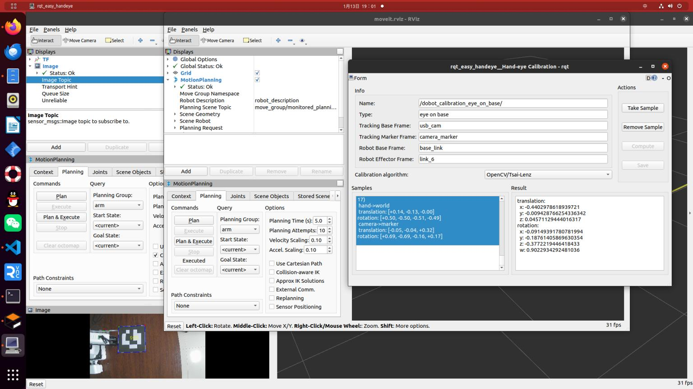

# 手眼标定
1. 下载arous_ros与easy_handeye包
```bash
git clone https://gitclone.com/github.com/IFL-CAMP/easy_handeye.git
git clone https://mirror.ghproxy.com/https://github.com/pal-robotics/aruco_ros.git
git clone -b noetic-devel https://github.com/pal-robotics/aruco_ros.git
```
2. 开始之前，将机械臂与相机的位置进行固定，并打印Marker
这里利用 arous_ros，需要修改single.launch文件，需要将MarkerID，Size等信息进行修改

```xml
<launch>
<arg name="namespace_prefix" default="dobot_calibration" />

<arg name="marker_size" default="0.1" />
<arg name="marker_id" default="903"/>
<arg name="eye" default="left"/>

<include file="$(find robot_vision)/launch/usb_cam_with_calibration.launch" />
<!-- 2. start the robot -->
<include file="$(find dobot_moveit_config)/launch/dobot_moveit_planning_executiuon.launch" />
<!-- 3. start aruco_tracker node -->
<node name="aruco_tracker" pkg="aruco_ros" type="single">
<remap from="/camera_info" to="/usb_cam/camera_info" />
<remap from="/image" to="/usb_cam/image_raw" />
<param name="image_is_rectified" value="true"/>
<param name="marker_size" value="$(arg marker_size)"/>
<param name="marker_id" value="$(arg marker_id)"/>
<param name="reference_frame" value="usb_cam"/>
<param name="camera_frame" value="usb_cam"/>
<param name="marker_frame" value="camera_marker" />
</node>

<!-- 4. start easy_handeye -->
<include file="$(find easy_handeye)/launch/calibrate.launch" >
<arg name="namespace_prefix" value="$(arg namespace_prefix)" />
<arg name="move_group" default="arm" />
<arg name="eye_on_hand" value="false" />
<arg name="tracking_base_frame" value="usb_cam" />
<arg name="tracking_marker_frame" value="camera_marker" />
<arg name="robot_base_frame" value="base_link" />
<arg name="robot_effector_frame" value="link_6" />

<arg name="freehand_robot_movement" value="false" />
<arg name="robot_velocity_scaling" value="0.5" />
<arg name="robot_acceleration_scaling" value="0.2" />
</include>
</launch>
```

标定过程

标定结果


接下来就是将手眼标定发布出去

https://www.guyuehome.com/36266

在网上查找出大致两种方式:第一种就是将easy_handeye包里的publish.launch与publish.py进行修改之后，.py文件也需要修改这里并没有提供
如果想要使用第一种方法修改.py文件可以参考王晓云 ros机械臂开发与实践中的代码

```xml
<?xml version="1.0"?>
<launch>
    <arg name="eye_on_hand" doc="eye-on-hand instead of eye-on-base" default="false"/>
    <arg name="namespace_prefix" default="dobot_calibration" />
    <arg if="$(arg eye_on_hand)" name="namespace" value="$(arg namespace_prefix)_eye_on_hand" />
    <arg unless="$(arg eye_on_hand)" name="namespace" value="$(arg namespace_prefix)_eye_on_base" />

    <!--it is possible to override the link names saved in the yaml file in case of name clashes, for example-->
    <arg if="$(arg eye_on_hand)" name="robot_effector_frame" default="" />
    <arg unless="$(arg eye_on_hand)" name="robot_base_frame" default="" />
    <arg name="tracking_base_frame" default="" />
   
    <arg name="inverse" default="false" />
    <arg name="calibration_file" default="" />
   
    <!--publish hand-eye calibration-->
    <group ns="$(arg namespace)">
        <param name="eye_on_hand" value="$(arg eye_on_hand)" />
        <param unless="$(arg eye_on_hand)" name="robot_base_frame" value="$(arg robot_base_frame)" />
        <param if="$(arg eye_on_hand)" name="robot_effector_frame" value="$(arg robot_effector_frame)" />
        <param name="tracking_base_frame" value="$(arg tracking_base_frame)" />
        <param name="inverse" value="$(arg inverse)" />
        <param name="calibration_file" value="$(arg calibration_file)" />
        <node name="$(anon handeye_publisher)" pkg="dobot" type="publish.py" output="screen"/>
    </group>
</launch>
```

另一种就是直接编写launch文件将手眼标定结果发布给tf中静态坐标变换

```xml
<launch> 
    <node pkg="tf" type="static_transform_publisher" name="tf_broadcaster" 
        args = "-0.4402978618939721 -0.009428766254336342 0.04571129444016317 -0.09149391780781994 -0.18761405869630354 -0.3772219446418433 0.9022934292481036 base_link usb_cam 100"> 
    </node> 
</launch>
```
